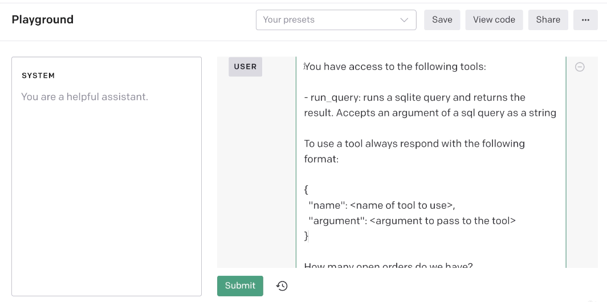
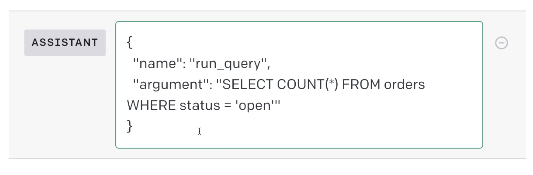

# Overview
This companion project is based on the Udemy course:  
**ChatGPT and LangChain: The Complete Developer's Masterclass**.  

The objective is to practice Golang while exploring LangChain concepts. 
The project includes examples from the original course, rewritten in Golang using the `langchaingo` library.

## Prerequisites
 - To use this project, extract the `diagrams` provided in the original course   
   and place them in the `diagrams` folder of this project.  
 - To use the various utilities bash scripts,  
   you need to have to create a `openai-api-key.txt` under the `src` folder.  
   containing your OpenAI API key.  
## -----------------------------------------------------------
## Section 2 ChatGPT with LangChain integration
## -----------------------------------------------------------

## 7. Important Python and Pipenv Environment Setup Information

## 8. Project Overview and Setup

## 9. Creating an OpenAI API Key

## 10. Using LangChain the Simple Way
- [ref](https://tmc.github.io/langchaingo/docs/getting-started/guide-openai)

## 11. Introducing Chains
- [ref](diagrams/06-chain.pdf)

## 12. Adding a Chain
  - [ref](https://github.com/tmc/langchaingo/blob/main/examples/llm-chain-example/llm_chain.go)
 - If a chain only needs one input we can use Run to execute it. 
   snippet: `out, err := chains.Run(ctx, llmChain, "socks")`

 - Otherwise the call function must be used.
   snippet: `outputValues, err := chains.Call(ctx, llmChain, map[string]any{`


## 13. Parsing Command Line Arguments

## 14. Securing the API Key

## 15. Connecting Chains Together


## 16. Chains in Series with SequentialChain
https://github.com/tmc/langchaingo/tree/main/examples/sequential-chain-example
Not working when multiple inputs are provided for the second chain.
[SequentialChain removes the input of previuos call](https://github.com/tmc/langchaingo/issues/629)

## -----------------------------------------------------------
## Section 3 Deep Dive into Memory Management
## -----------------------------------------------------------

## 17. Important Pipenv Environment Setup Information

## 18. App Overview

## 19. Receiving User Input

## 20. Chat vs Completion Style Models

## 21. Representing Messages with ChatPromptTemplates

https://github.com/tmc/langchaingo/blob/main/examples/openai-chat-example/openai_chat_example.go
https://tmc.github.io/langchaingo/docs/modules/model_io/prompts/prompt_templates/

## 22. Implementing a Chat Chain
import ChatOpenAI.
So notice that we are not importing our model from LLM or LLMs as we did previously on our last project.
So this is an instance of where LangChain seems to think that the word LLM implies a completion model.
And again, that's not really the case. Chat GPT is still an LLM, but they kinda make this distinction
and they call these chat models something totally different.

## 23. Understanding Memory

## 24. Using ChatBufferMemory to Store Conversations
My example:
[src](src/l24-conversation/main.go)
Note this example DOES NOT use any persistence layer like SQLite
Note this example uses a custom HTTP client to log requests and responses `httputil.DebugHTTPClient)`. 
Example: 
Conversational Memory with SQLite in LangChain
https://github.com/tmc/langchaingo/tree/main/examples/chains-conversation-memory-sqlite
MessagesPlaceholder
https://github.com/tmc/langchaingo/blob/1975058648b5914fdd9dc53434c5b59f219e2b5c/prompts/message_prompt_template.go#L111


## 25. Saving and Extending Conversations
[src](src/l25-sqlite3/main.go)

## 26. Summarizations Conversation Summary Memory
*TODO*
- The following examples are not exactly about the lecture topic but they are related to Summmarization
- [example1](https://github.com/tmc/langchaingo/tree/main/examples/llmsummarization-chain-example)
- [example2](https://github.com/tmc/langchaingo/tree/main/examples/mistral-summarization-example)


## -----------------------------------------------------------
## Section 4 - Adding context with embeddings techniques
## -----------------------------------------------------------

## 27. Project Overview

## 28. Facts File Download

## 29. Important Pipenv Environment Setup Information

## 30. Project Setup

## 31. Loading Files with Document Loaders
[ref](https://tmc.github.io/langchaingo/docs/modules/data_connection/text_splitters/examples/)

There's many other very interesting `loaders`.
For example, `PDFLoader` that allows us to open up and extract all the texts out of a PDF,

A `document` is a very special thing inside of LangChain.
So there's an actual class called a document. Every document is gonna have at least two properties
assigned to it. One is going to be `page content`. This is the actual content inside the file.
The other is `metadata`. And this is going to be a dictionary that has some information about where the contents
or where this document really came from. It can effectively store any information we want inside of this dictionary, but very often
by default you'll see that it has a key or source and that will usually tell you
the name of the file or some other details about where this document actually came from.


## 32. Search Criteria

## 33. Introducing Embeddings

## 34. The Entire Embedding Flow

## 35. Chunking Text

## 36. Generating Embeddings
[ref](https://github.com/tmc/langchaingo/tree/main/examples/openai-embeddings-example)

## -----------------------------------------------------------
## Section 5 - Custom Document Retrieval
## -----------------------------------------------------------

## 37. Introducing ChromaDB
 - Running Chroma with Docker
   [ref](https://github.com/tmc/langchaingo/tree/main/vectorstores/chroma#running-with-docker)
 - [example](https://github.com/tmc/langchaingo/tree/main/examples/chroma-vectorstore-example)
 - [Chroma Support](https://github.com/tmc/langchaingo/tree/main/vectorstores/chroma)
 - [chroma container 0.5.5](https://github.com/chroma-core/chroma/pkgs/container/chroma/247214220?tag=0.5.5)
 - [chroma container latest](https://github.com/chroma-core/chroma/pkgs/container/chroma/247214220?tag=latest)
 
## 38. Building a Retrieval Chain
## 39. What is a Retriever?
- Retrievers 
- [ref](https://tmc.github.io/langchaingo/docs/modules/data_connection/retrievers/)
- LoadRefineQA:
- [ref2](https://github.com/tmc/langchaingo/tree/main/examples/document-qa-example)
- Puting it all together
- [l39-retriever](src/l39-retriever/cmd/main.go)


## 40. [Optional] Understanding Refine, MapReduce, and MapRerank

## 41. Removing Duplicate Documents

## 42. Creating a Custom Retriever

## 43. Custom Retriever in Action

## 44. Understanding Embeddings Download

## 45. Visualizing Embeddings

## -----------------------------------------------------------
## Section 6 - Empower ChatGPT with Tools and Agents
## -----------------------------------------------------------

## 46. Important Pipenv Environment Setup Information

## 47. App Overview
- [slides](diagrams/09-agents.pdf)
- 
## 48. Understanding Tools
- [slides](diagrams/09-agents.pdf)
- So I'm gonna say that there's kind of like a `function` named run_query.
- 
- 
-

## 49. Understanding ChatGPT Functions
Now, this entire technique works not only with ChatGPT, but with just about any language model.
*But to use other LLM models we need to use the plain text approach*
So we can add in that initial little bit right there to our initial prompt that we send off to a language model,
and a language model is gonna try to use those tools. It works particularly well with completion-based models.


## 50. SQLite Database Download

## 51. Defining a Tool

## 52. Defining an Agent and AgentExecutor

## 53. Understanding Agents and AgentExecutors
- NB Nice important lecture
- An agent is almost identical to a chain. 
  The only difference is that an agent knows how to accept a list of tools and actually make use of them.
- Agent Executor
It takes an agent, so pretty much a chain and it runs that chain over and over again until the response we get back from ChatGPT is not a request to make a function call. So we can really think of this thing as being like a really fancy while loop

```go
//This will actually create the agent and assign it to the executor
//View Udemy S6L53 03:34
executor, err := agents.Initialize(
	llm,
	agentTools,
	agents.ZeroShotReactDescription,
	agents.WithMaxIterations(3),
)
if err != nil {
	return err
}
```

### agent scratchpad
Agent scratchpad is very similar to memory.
And when we get that result, the intent here, what we have to do, we of course need to send our full list of messages as a follow-up request off to ChatGPT because remember huge idea here that we've gone over several times ChatGPT does not remember your conversation.

So when we do that follow up request to ChatGPT, we need to include the user's original message.
We need to include the fact that ChatGPT asked to run a function and then we need to include the result
of calling that function.
The goal of this agent scratch pad right here is to capture these kind of intermediate messages.
So it's very similar in purpose to memory.


```go
// This will call NewConversationalAgent that has a Plan method with will call 'agent_scratchpad' constructScratchPad
executor, err := agents.Initialize(...)
```

## 54. Shortcomings in ChatGPT's Assumptions

## 55. Recovering from Errors in Tools

## 56. Adding Table Context
Remember these function `descriptions` are eventually sent off to ChatGPT and right now OpenAI limits the amount of text that you can put in to a function description

## 57. Adding a Table Description Tool
You see sometimes `ChatGPT` thinks that it just knows what's best for answering some of these questions
and it's going to refuse to use some tools.

## 58. Being Direct with System Messages

## 59. Adding Better Descriptions for Tool Arguments
I made a change to the actual source code of Langchain on my computer. 
And this change allows me to take a look at the function arguments that get sent off to ChatGPT.

## 60. Tools with Multiple Arguments

## 61. Memory vs Agent Scratchpad

## 62. Preserving Messages with Agent Executor

## 63. Understanding Callbacks

## 64. Implementing a Basic Callback Handler

## 65. More Handler Implementation 3


## 68. pdf project
[github](https://github.com/0x-cygnet/langchain-pdf)

## 92. ConversationalRetrieval Chain
- [conversational_retrieval_qa](https://github.com/tmc/langchaingo/blob/main/chains/conversational_retrieval_qa.go)
- [conversational_retrieval_qa_test](https://github.com/tmc/langchaingo/blob/main/chains/conversational_retrieval_qa_test.go)
-

## 93. 

